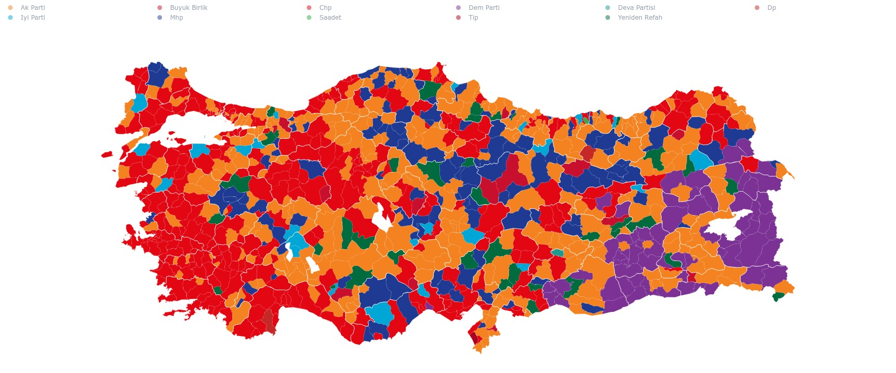

# ysk

Temizlenmis YSK secim sonuclari verisi.

## Kurulum

```bash
pip install ysk
```

## İçerik

Bu repo, `src/ysk/data/secim.zarr` altinda tek bir xarray/zarr veri seti olarak
duzenlenmis YSK sonuclarini icerir. Veri seti; secim tarihi, makam, yer ve
tercih koordinatlariyla okunabilir. Paket icindeki yardimci fonksiyonlar bu
veriyi analiz icin hazir pandas tablolarina donusturur.

Yer bilgisi il, ilce, belde, mahalle ve sandik seviyelerinde tutulur. Oylar
parti, aday, ittifak veya diger tercih adlariyla kolonlasir; secmen sayilari
sonuc tablolarinda yer alir. Cinsiyet kirilimi `level="ilce"` ve `level="il"`
sonuclarina eklenir.

Ana dosya:

```text
src/ysk/data/secim.zarr
```

## Örnek

Harita sinirlari ve cizim yardimcilari `turkiye` paketinden gelir:

```python
import turkiye
import ysk


def set_winner(df):
  oy = ysk.filter_columns(df, types=ysk.Kolon.PARTI | ysk.Kolon.BAGIMSIZ)
  toplam = oy.sum(axis=1).where(lambda deger: deger > 0)
  df[["birinci_parti", "birinci_parti_oy"]] = oy.agg(["idxmax", "max"], axis=1)
  df["birinci_parti_oran"] = df["birinci_parti_oy"] / toplam * 100


ilce = ysk.election_results(
  ysk.Secim.YEREL_2024,
  ysk.Makam.BELEDIYE_BASKANI,
  level="ilce",
)

set_winner(ilce)

ax = turkiye.plot(
  ilce,
  color="birinci_parti",
  color_map=ysk.PARTI_RENKLERI,
  legend=True,
  backend="matplotlib",
)
ax.set_title("2024 Yerel Secimleri")
```

Ornek cikti:



## En Kolay Kullanim

```python
import ysk

df = ysk.election_results(
  ysk.Secim.YEREL_2024,
  ysk.Makam.BUYUKSEHIR_BELEDIYE_BASKANI,
  level="ilce",
)
df.head()
```

Sonuc, analiz icin hazir bir pandas DataFrame'dir:

```text
                         secmen  oy_kullanan  gecerli  gecersiz  ak_parti  chp ...
il       ilce
ISTANBUL ADALAR            ...          ...      ...       ...       ...  ...
         ARNAVUTKOY        ...          ...      ...       ...       ...  ...
```

## Secim ve Makam

`election` icin `Secim`, `office` icin `Makam` enumlarini kullanin.

```python
from ysk import Makam, Secim, election_results

election_results(Secim.YEREL_2024, Makam.BUYUKSEHIR_BELEDIYE_BASKANI)
election_results(Secim.YEREL_2024, Makam.BELEDIYE_MECLISI)
election_results(Secim.GENEL_2023, Makam.CUMHURBASKANI)
election_results(Secim.GENEL_2023, Makam.MILLETVEKILI)
```

Birden fazla secimi ayni anda alabilirsiniz:

```python
df = election_results(
  [Secim.YEREL_2019, Secim.YEREL_2024],
  Makam.BUYUKSEHIR_BELEDIYE_BASKANI,
  province="ISTANBUL",
  district="USKUDAR",
)

df.head()
```

Bu durumda kolonlar MultiIndex olur:

```text
secim       2019-03-31                  2024-03-31
alan        secmen  gecerli  chp ...    secmen  gecerli  chp ...
il ilce ...
```

Birden fazla makam da birlikte secilebilir:

```python
df = election_results(
  Secim.YEREL_2024,
  [Makam.BUYUKSEHIR_BELEDIYE_BASKANI, Makam.BELEDIYE_MECLISI],
  province="ISTANBUL",
  level="ilce",
)
```

## Seviyeler

`level` parametresi tablonun hangi kirilimda donecegini belirler:

```python
election_results(Secim.YEREL_2024, Makam.BUYUKSEHIR_BELEDIYE_BASKANI, level="sandik")
election_results(Secim.YEREL_2024, Makam.BUYUKSEHIR_BELEDIYE_BASKANI, level="mahalle")
election_results(Secim.YEREL_2024, Makam.BUYUKSEHIR_BELEDIYE_BASKANI, level="belde")
election_results(Secim.YEREL_2024, Makam.BUYUKSEHIR_BELEDIYE_BASKANI, level="ilce")
election_results(Secim.YEREL_2024, Makam.BUYUKSEHIR_BELEDIYE_BASKANI, level="il")
```

`sandik` seviyesi yurt ici sandiklari, gumruk ve ulke satirlarini birlikte
tutar. Daha yuksek seviyeler sandik verisinden gruplanarak hesaplanir.

## Il ve Ilce

```python
ankara = election_results(
  Secim.YEREL_2024,
  Makam.BUYUKSEHIR_BELEDIYE_BASKANI,
  province="ANKARA",
  level="ilce",
)
cankaya = election_results(
  Secim.YEREL_2024,
  Makam.BUYUKSEHIR_BELEDIYE_BASKANI,
  province="ANKARA",
  district="CANKAYA",
)
```

Ilce adlarinda bazi tarihsel farklar normalize edilir. Ornegin `ONDOKUZMAYIS` ve
`19 MAYIS` ayni ad altinda hizalanir. `SEMDINLI - DERECIK` gibi kaynak adlari
temizlenerek ilce ve belde bilgisi ayrilir.

Birden fazla secimi karsilastirirken, sonradan ilce olan yerleri eski idari
sinirlara toplamak icin `align_historical_divisions=True` argumanini
kullanabilirsiniz. Bu secenek yalnizca `level="ilce"` sonuclarinda etkilidir:

```python
df = election_results(
  [Secim.YEREL_2014, Secim.YEREL_2024],
  Makam.BELEDIYE_BASKANI,
  province="HAKKARI",
  level="ilce",
  align_historical_divisions=True,
)
```

## Oy, Secmen ve Cinsiyet

Donen tabloda, varsa toplam kolonlari basta gelir:

```text
secmen, oy_kullanan, gecerli, gecersiz,
gecerli_itirazsiz, gecerli_itirazli, kadin, erkek
```

Bunlardan sonra parti, aday, ittifak veya tercih kolonlari gelir.

Ilce seviyesinde kadin secmen sayisi ile CHP oyu arasindaki korelasyon:

```python
df = election_results(
  Secim.YEREL_2024,
  Makam.BUYUKSEHIR_BELEDIYE_BASKANI,
  province="ISTANBUL",
  level="ilce",
)

df[["kadin", "chp"]].corr()
```

Sadece belirli tercihleri almak icin:

```python
df = election_results(
  Secim.YEREL_2024,
  Makam.BUYUKSEHIR_BELEDIYE_BASKANI,
  province="ISTANBUL",
  level="ilce",
  choices=["chp", "ak_parti", "mhp"],
)
```

Sandik seviyesinde oy ve secmen bilgilerini birlikte kullanmak:

```python
df = election_results(
  Secim.YEREL_2024,
  Makam.BUYUKSEHIR_BELEDIYE_BASKANI,
  province="ISTANBUL",
  district="USKUDAR",
)

df[["secmen", "chp", "ak_parti"]].head()
```

`kadin` ve `erkek` ilce seviyesinde tutulan demografik kolonlardir; sandik
seviyesinde tekrarlanmazlar. Bu kolonlar `level="ilce"` ve `level="il"`
sonuclarina ayri demografi verisinden eklenir.

Kolon gruplarini filtrelemek icin:

```python
from ysk import Kolon, filter_columns

partiler = filter_columns(df, types=Kolon.PARTI)
toplam_ve_bagimsiz = filter_columns(df, types=Kolon.TOPLAM | Kolon.BAGIMSIZ)
```

## Ham Xarray Verisi

Hazir zarr veri setini dogrudan xarray ile acmak icin:

```python
from ysk import load_dataset

ds = load_dataset()
ds
```

Alternatif:

```python
import xarray as xr

ds = xr.open_zarr("src/ysk/data/secim.zarr")
```

Ornek secim:

```python
from ysk import Makam, Secim

bbb_2024 = ds.sel(secim=Secim.YEREL_2024).sel(makam=Makam.BUYUKSEHIR_BELEDIYE_BASKANI)
```

Eksenleri ve degiskenleri gormek icin:

```python
ds.dims
ds.coords
list(ds.data_vars)
```

Tum zarr'i tek seferde DataFrame'e cevirmek bellek tasmasina yol acabilir:

```python
# Bunu genelde yapmayin:
# ds.oy.to_dataframe()
```

Once secim, makam, il veya ilce ile daraltmak ya da `election_results()`
yardimcisini kullanmak daha guvenlidir.

## Veri Formati

Ana format zarr'dir. Zarr, xarray ile uyumlu, parca parca okunabilen N-boyutlu
veri saklama formatidir. Bu repo icin dogal model secim, makam, yer ve tercih
koordinatlari olan etiketli bir veri setidir.

Parquet tablo/SQL isleri icin daha uygundur. Bu repoda zarr kanonik veri formati
olarak tutulur; analiz tablolarini `election_results()` uretir.
